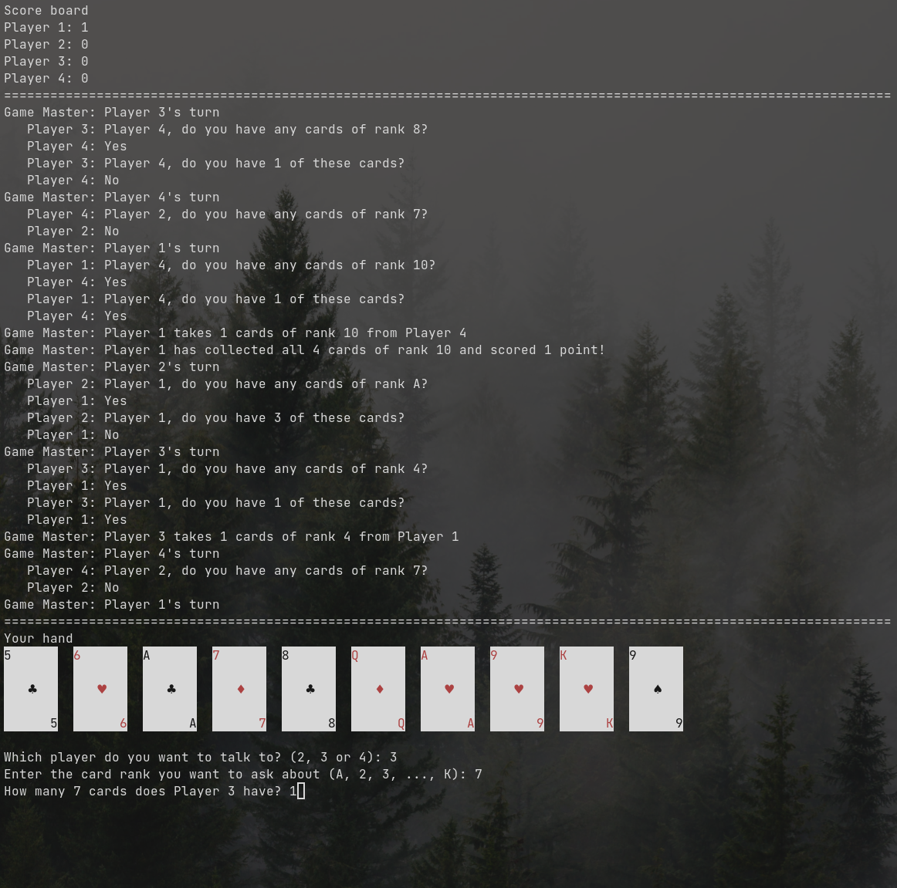

```
░░██████████████████████████░░  # Chests - A card game
░░██▓▓▓▓▓▓▓▓▓▓▓▓▓▓▓▓▓▓▓▓▓▓▓▓░░
  ██▒▒▒▒▒▒▒▒▒▒▒▒▒▒▒▒▒▒▒▒▒▒▒▒    A simple card game in your terminal. Play against 3 bots to collect as many
  ██▓▓▓▓▓▓          ██▓▓▓▓▓▓░░  complete sets of four cards (chests) of each rank as possible. Each player
        ░░  ▓▓▓▓██  ░░░░░░░░░░  starts with 13 cards, and the game ends when all 13 sets are collected.
░░░░░░░░░░░░██████░░░░░░░░░░░░
░░████████░░░░░░░░░░████████░░  Observing the responses and recalling previous turns will help you deduce
░░██▓▓▓▓▓▓████████████▓▓▓▓▓▓░░  who holds which cards.
░░██▓▓▓▓▓▓▓▓▓▓▓▓▓▓▓▓▓▓▓▓▓▓▓▓░░
░░██▓▓▓▓▓▓▓▓▓▓▓▓▓▓▓▓▓▓▓▓▓▓▓▓░░
░░██▓▓▓▓▓▓▓▓▓▓▓▓▓▓▓▓▓▓▓▓▓▓▓▓░░
░░░░░░░░░░░░░░░░░░░░░░░░░░░░░░
▓▓▓▓                      ▓▓▓▓
```

Note: The game was created because I had an itch for terminal card games. I
wanted something I can quickly put together and play without requiring too much
development time.
The bots are very dumb and don't really pose any challenges. If you're lucky,
you might see them collecting 3 or 4 chests altogether, but at the moment I
don't have the drive to improve their AI.

## How to play
1. `git clone https://github.com/DTLP/chests-card-game.git`
2. `cd chests-card-game`
3. `go run .`

On each turn your task is to challenge an opponent by guessing how many cards of
a certain rank they have in their hand. If your guess is correct, you take their
cards. Score points are granted for each collection of four cards of each rank.

## TODO:
[x] Draw player's hand  
[x] 4 players  
[x] Taking guesses  
[x] Taking cards from others  
[x] Score board  
[x] Bots  
[x] Improved loggging  
[x] Improved UI  
[ ] Take another turn if guessed correctly  
[ ] Guess card suits after correctly guessing number of cards


